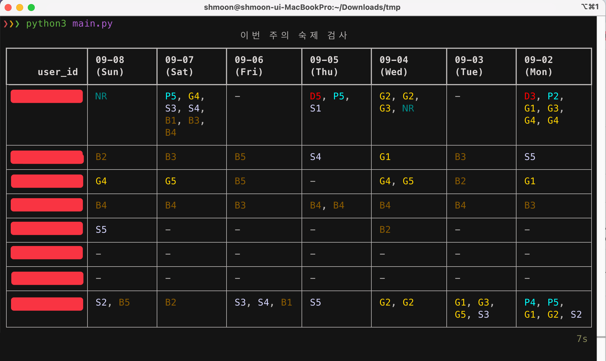

# Boj stat visualizer

### Demo




*names are masked for privacy*

### Usage

```sh
# method 1. execute with user_id list arguments
python main.py user_name_a user_name_b user_name_c ...

# method 2. edit 'USER_IDS' list value in the main.py then execute without arguments
python main.py
```
